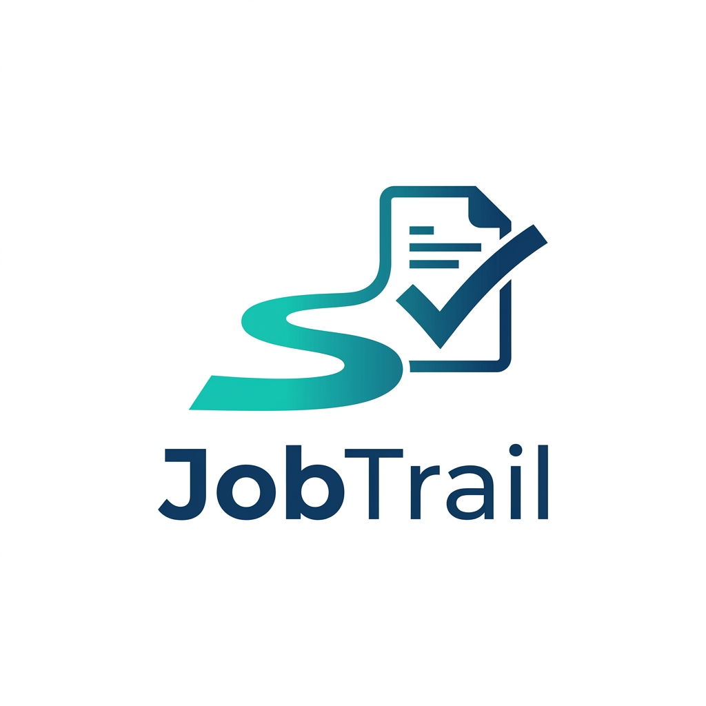
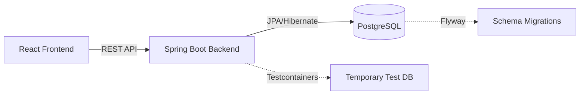

<div align="center">
  
  <h1>JobTrail</h1>
  
</div>

A full-stack job application tracker built with Spring Boot, React, and PostgreSQL.

## Status
🚧 Under active development

## Architecture


## Tech Stack
- **Backend:** Java 25, Spring Boot 3, PostgreSQL, Flyway, Testcontainers
- **Frontend:** React, Tailwind CSS (Coming Soon)
- **DevOps:** Docker, Docker Compose, GitHub Actions, Orbit (Local DAG Orchestrator)

## Features Completed
- [x] **Day 1: Base Application CRUD & Auth Skeleton** - Core endpoints, database enumerations, and Testcontainers integration.
- [x] **Day 2: Status Pipeline** - Strict state machine validation for application status transitions, full history tracking, and REST endpoints.

## Local Setup

### Backend (Spring Boot)
1. **Start Docker Desktop**: Testcontainers requires Docker to be running in the background to automatically spin up a temporary PostgreSQL database for testing.
2. Run the tests (Orbit `test` task equivalent):
   ```bash
   cd backend
   ./mvnw clean test
   ```
3. Start the application locally (Coming soon: Local PostgreSQL setup via Docker Compose).

## API Endpoints (Core)
*   `GET /api/applications` - List all applications
*   `POST /api/applications` - Create a new application
*   `PATCH /api/applications/{id}/status` - Safely transition application status
*   `GET /api/applications/{id}/history` - View the entire status transition timeline